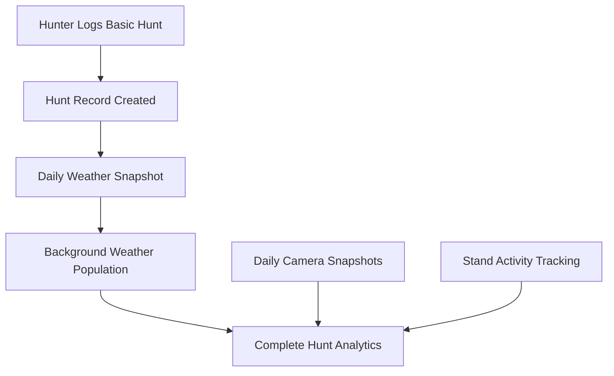

# Hunt Logging System - Design Document

**Document Purpose**: Complete design specification for hunt logging system integrating with existing daily snapshot infrastructure.

**Last Updated**: 2025-07-28  
**Status**: ✅ **Design Complete - Ready for Implementation** 

---

## 🎯 **System Overview**

### **Core Philosophy**
- **User Experience**: Minimal input, maximum value (30-second mobile logging)
- **Data Strategy**: Historical enrichment via daily snapshots (not real-time)
- **Integration**: Leverage existing weather/camera snapshot infrastructure
- **Analytics**: Rich correlations for hunting pattern analysis

### **Key Integration Points**


## 📊 **Current Database State (Phase 1 Complete)**

### **Existing Hunt Logging Tables** ✅
```sql
-- Already created and functional
hunt_logs (28 fields)      -- Core hunt data with auto-population fields
hunt_harvests (22 fields)  -- Detailed harvest information  
hunt_sightings (14 fields) -- Animal observations during hunt
```

### **Enhanced Stand Activity** ✅
```sql
-- Stands table enhanced with hunt tracking
last_hunted, total_hunts, total_harvests, 
last_harvest, success_rate, last_hunted_by, last_harvest_by
```

### **Daily Snapshot Integration** ✅
```sql
-- Existing infrastructure to leverage
daily_weather_snapshots    -- Historical weather data
daily_camera_snapshots     -- Camera activity trends
daily_collection_log       -- System health monitoring
```

---

## 🔧 **Revised Data Flow Strategy**

### **Phase 1: Immediate Hunt Logging** (Real-time)
```typescript
// User logs hunt (30 seconds on mobile)
const huntLog = {
  hunt_date: '2025-01-28',
  member_id: 'user-uuid',
  stand_id: 'stand-uuid',
  time_period: 'AM', // or 'PM', 'ALL_DAY'
  start_time: '06:30', // optional exact time
  end_time: '09:15',   // optional exact time
  had_harvest: false,
  notes: 'Saw 3 does around 7:30'
  
  // Weather fields left NULL initially
  temperature_high: null,
  wind_speed: null,
  moon_phase: null,
  // ... etc
}
```

### **Phase 2: Weather Enrichment** (Next day via cron)
```typescript
// Background process after daily weather collection
async function enrichHuntWeather() {
  // Find hunts missing weather data
  const huntsNeedingWeather = await getHuntsWithoutWeather()
  
  for (const hunt of huntsNeedingWeather) {
    // Get weather from daily snapshot for hunt date
    const weather = await getWeatherSnapshot(hunt.hunt_date)
    
    if (weather) {
      // Calculate hunt-specific data
      const enrichedData = {
        temperature_high: weather.tempmax,
        temperature_low: weather.tempmin,
        wind_speed: weather.windspeed,
        moon_phase: weather.moonphase,
        sunrise_time: weather.sunrise,
        sunset_time: weather.sunset,
        legal_hunting_start: weather.legal_hunting_start,
        legal_hunting_end: weather.legal_hunting_end,
        hunting_season: calculateSeason(hunt.hunt_date),
        property_sector: deriveFromStand(hunt.stand_id),
        weather_fetched_at: new Date()
      }
      
      await updateHuntWeather(hunt.id, enrichedData)
    }
  }
}
```

---

## 📱 **Mobile-First User Experience**

### **Hunt Entry Flow**
```
1. Basic Hunt Entry (Required Fields - 15-20 seconds)
   ├── Hunt Date (default: today)
   ├── Stand Selection (required dropdown) *
   ├── Time Period (smart default based on current time)
   └── Had Harvest? (Yes/No toggle)

2. Optional Details (Expandable)
   ├── Exact Start/End Times
   └── General Notes

3. Action Buttons (Integrated Choice)
   ├── PRIMARY: "Submit Hunt Log" (big green button)
   └── OPTIONAL: "+ Sightings" (smaller outline button)

4. Conditional: Harvest Details (if Yes above)
   ├── Animal Count (1 default)
   ├── Buck/Doe breakdown
   ├── Shot distance & weapon
   └── Actions: "Submit Hunt Log" OR "+ Sightings"

5. Optional: Sightings (only if user chooses)
   ├── Add Animal Sighting button
   ├── Type, count, time, behavior
   ├── Notes per sighting
   └── Action: "Continue to Review"

6. Review & Submit
   ├── Hunt logged immediately
   ├── "Weather data will be added tomorrow"
   └── Navigate to hunt history or log another
```

### **Smart Defaults & Speed Optimizations**
```typescript
// Auto-populate based on context
const huntDefaults = {
  hunt_date: new Date().toISOString().split('T')[0], // Today
  time_period: getCurrentTimePeriod(), // AM (5-12) / PM (12-20) / AM (default)
  stand_id: null, // REQUIRED - must be selected
  had_harvest: false
}

// Smart time period selection
function getCurrentTimePeriod(): 'AM' | 'PM' {
  const hour = new Date().getHours()
  if (hour >= 5 && hour < 12) return 'AM'   // 5 AM to 12 PM = Morning hunt
  if (hour >= 12 && hour < 20) return 'PM'  // 12 PM to 8 PM = Evening hunt
  return 'AM' // Default for late night/early morning entries
}
```

### **Key UX Decisions**
- **Required vs Optional**: Only stand selection is required (marked with *)
- **Smart Defaults**: Time period auto-selected based on current time
- **Integrated Choice**: Sightings choice on same screen (no extra step)
- **Visual Hierarchy**: Primary action (Submit) is prominent, optional action (Sightings) is secondary
- **Progressive Enhancement**: Basic hunt in 15-20 seconds, detailed data when desired

---

## 🎯 **Final Workflow Specifications**

### **Button Layout & Actions**

#### **Basic Form (No Harvest)**
```
[              Submit Hunt Log              ] [+ Sightings]
     Primary (green, full-width)              Secondary
```

#### **Basic Form (With Harvest)**
```
[         Next: Harvest Details            ]
     Primary (green, full-width)
```

#### **Harvest Form**
```
[              Submit Hunt Log              ] [+ Sightings]
     Primary (green, full-width)              Secondary
```

#### **Sightings Form**
```
[    Back    ] [        Continue to Review        ]
   Secondary              Primary
```

### **Form Validation Rules**
```typescript
const validationRules = {
  // Required fields
  hunt_date: required,
  stand_id: required, // Cannot proceed without stand selection
  time_period: auto_populated, // Smart default based on current time
  
  // Optional fields
  start_time: optional,
  end_time: optional,
  notes: optional,
  
  // Conditional fields (only if had_harvest = true)
  harvest_details: conditional_on_harvest,
  
  // Always optional
  sightings: always_optional
}
```

### **Navigation Logic**
```typescript
const navigationFlow = {
  from_basic_no_harvest: {
    submit: 'review',
    add_sightings: 'sightings'
  },
  from_basic_with_harvest: {
    next: 'harvest'
  },
  from_harvest: {
    submit: 'review',
    add_sightings: 'sightings'
  },
  from_sightings: {
    continue: 'review'
  },
  from_review: {
    submit: 'success'
  }
}
```

### **Speed Benchmarks**
- **Minimum viable hunt log**: 15-20 seconds (3 taps + form)
- **Hunt with harvest**: 45-60 seconds
- **Hunt with harvest + sightings**: 60-90 seconds
- **Complex hunt log**: Under 2 minutes (all fields)
```typescript
// Hunt entry validation schema
const HuntEntrySchema = z.object({
  hunt_date: z.string().regex(/^\d{4}-\d{2}-\d{2}$/, 'Invalid date format'),
  member_id: z.string().uuid(),
  stand_id: z.string().uuid().nullable(),
  time_period: z.enum(['AM', 'PM', 'ALL_DAY']),
  start_time: z.string().regex(/^\d{2}:\d{2}$/).optional(),
  end_time: z.string().regex(/^\d{2}:\d{2}$/).optional(),
  had_harvest: z.boolean(),
  notes: z.string().max(1000).optional(),
}).refine((data) => {
  // If exact times provided, start must be before end
  if (data.start_time && data.end_time) {
    return data.start_time < data.end_time
  }
  return true
}, {
  message: "Start time must be before end time",
  path: ["end_time"]
})

// Harvest details validation (conditional)
const HarvestDetailsSchema = z.object({
  animal_type: z.string().default('deer'),
  gender: z.enum(['Buck', 'Doe', 'Unknown']).optional(),
  estimated_weight: z.number().min(10).max(400).optional(),
  shot_distance_yards: z.number().min(5).max(500).optional(),
  // ... additional harvest fields
})

// Sightings validation (multiple entries)
const SightingSchema = z.object({
  animal_type: z.string(),
  count: z.number().min(1).max(50),
  time_observed: z.string().regex(/^\d{2}:\d{2}$/).optional(),
  behavior: z.string().max(200).optional(),
  // ... additional sighting fields
})
```

---

## 🌤️ **Weather Integration Strategy**

### **Legal Hunting Times Enhancement**
**Recommendation**: Add legal times to daily weather snapshots

```sql
-- Migration to add legal hunting times
ALTER TABLE daily_weather_snapshots 
ADD COLUMN legal_hunting_start time,
ADD COLUMN legal_hunting_end time,
ADD COLUMN hunting_season text; -- 'archery', 'gun', 'muzzleloader'

-- Update existing records and new collections
UPDATE daily_weather_snapshots 
SET legal_hunting_start = sunrise - interval '30 minutes',
    legal_hunting_end = sunset + interval '30 minutes'
WHERE legal_hunting_start IS NULL;
```

**Benefits**:
- ✅ Calculated once per day (efficient)
- ✅ Available for compliance checking
- ✅ Enables "hunt within legal hours" validation
- ✅ Supports future calendar integration

### **Weather Data Population Process**
```typescript
// Cron job: Daily at 9 AM (after weather collection)
async function populateHuntWeather() {
  // Get yesterday's date (weather now available)
  const yesterday = new Date()
  yesterday.setDate(yesterday.getDate() - 1)
  
  // Find hunts from yesterday missing weather
  const hunts = await database
    .from('hunt_logs')
    .select('*')
    .eq('hunt_date', yesterday.toISOString().split('T')[0])
    .is('weather_fetched_at', null)
  
  // Get weather snapshot for that date  
  const weather = await database
    .from('daily_weather_snapshots')
    .select('*')
    .eq('date', yesterday.toISOString().split('T')[0])
    .single()
  
  if (weather) {
    // Enrich each hunt with weather data
    for (const hunt of hunts) {
      await enrichHuntWithWeather(hunt, weather)
    }
  }
}
```

---

## 🗂️ **File Structure & Components**

### **Recommended File Organization**
```
src/
├── lib/hunt-logging/
│   ├── types.ts                  # TypeScript interfaces
│   ├── validation.ts             # Zod schemas  
│   ├── hunt-service.ts           # Core CRUD operations
│   ├── weather-enrichment.ts     # Background weather population
│   ├── analytics-service.ts      # Success rates, patterns
│   └── constants.ts              # Enums, defaults
├── components/hunt-logging/
│   ├── HuntEntryForm.tsx         # Main logging form
│   ├── HarvestDetailsForm.tsx    # Conditional harvest form
│   ├── SightingsForm.tsx         # Animal observations
│   ├── HuntHistory.tsx           # Recent hunts display
│   ├── HuntCard.tsx              # Individual hunt display
│   └── HuntAnalytics.tsx         # Success patterns
└── app/hunt-logging/
    ├── page.tsx                  # Main hunt logging page
    ├── history/page.tsx          # Hunt history page
    └── analytics/page.tsx        # Analytics dashboard
```

### **Component Integration Pattern**
```typescript
// Example: HuntEntryForm.tsx
export default function HuntEntryForm() {
  const { register, handleSubmit, formState: { errors } } = useForm({
    resolver: zodResolver(HuntEntrySchema),
    defaultValues: {
      hunt_date: new Date().toISOString().split('T')[0],
      time_period: 'AM',
      had_harvest: false
    }
  })
  
  const onSubmit = async (data: HuntFormData) => {
    // 1. Create hunt record immediately  
    const hunt = await huntService.createHunt(data)
    
    // 2. Show success with note about weather
    showToast("Hunt logged! Weather data will be added tomorrow.")
    
    // 3. Navigate to hunt history or create another
    router.push('/hunt-logging/history')
  }
  
  return (
    <form onSubmit={handleSubmit(onSubmit)}>
      {/* Mobile-optimized form fields */}
    </form>
  )
}
```

---

## 📈 **Analytics & Insights Strategy**

### **Key Metrics to Track**
```typescript
interface HuntAnalytics {
  // Success Patterns
  overall_success_rate: number
  success_by_stand: Record<string, number>
  success_by_weather: {
    temperature_ranges: Record<string, number>
    wind_conditions: Record<string, number> 
    moon_phases: Record<string, number>
  }
  
  // Temporal Patterns
  success_by_time_period: Record<'AM' | 'PM' | 'ALL_DAY', number>
  success_by_month: Record<string, number>
  success_by_season: Record<string, number>
  
  // Activity Trends
  total_hunts_this_season: number
  hunts_per_member: Record<string, number>
  favorite_stands: Array<{ stand_name: string, hunt_count: number }>
  
  // Wildlife Observations
  sightings_by_species: Record<string, number>
  deer_activity_patterns: {
    peak_sighting_times: string[]
    behavior_frequency: Record<string, number>
  }
}
```

### **Dashboard Widget Ideas**
- 🎯 **Success Rate Card**: Current season percentage
- 📊 **Weather Correlation Chart**: Temperature vs success
- 🌙 **Moon Phase Trends**: Best lunar conditions  
- 📍 **Stand Effectiveness**: Heat map of success rates
- 🦌 **Wildlife Activity**: Recent sightings timeline
- ⏰ **Peak Times**: Best hunting hours based on data

---

## 🚀 **Implementation Phases (Ready to Begin)**

### **Phase 1: Database Foundation** ✅ COMPLETE
- [x] Hunt logging tables created (hunt_logs, hunt_harvests, hunt_sightings)
- [x] Stand activity tracking enhanced with automatic triggers
- [x] Integration with existing snapshot system confirmed

### **Phase 2: Core Hunt Logging** (NEXT - 2-3 days)
- [ ] **Step 2.1**: Basic hunt entry form with smart defaults and validation
- [ ] **Step 2.2**: Hunt history display with auto-populated data
- [ ] **Step 2.3**: Background weather enrichment process (cron job)

### **Phase 3: Enhanced Data Capture** (2-3 days)  
- [ ] **Step 3.1**: Harvest details form (conditional)
- [ ] **Step 3.2**: Sightings tracking with add/remove functionality
- [ ] **Step 3.3**: Photo upload integration

### **Phase 4: Analytics & Insights** (3-4 days)
- [ ] **Step 4.1**: Success rate calculations and correlations
- [ ] **Step 4.2**: Weather pattern analysis and visualization
- [ ] **Step 4.3**: Stand effectiveness metrics and dashboard widgets

### **Phase 5: Integration & Polish** (2-3 days)
- [ ] **Step 5.1**: Navigation integration with existing site
- [ ] **Step 5.2**: Mobile optimizations and performance tuning
- [ ] **Step 5.3**: User testing and refinement

---

## ✅ **Design Validation Complete**

This design document reflects the final workflow decisions from interactive prototype testing:

### **Validated Design Decisions**
- ✅ **Smart time defaults** based on current time (5AM-12PM = AM, 12PM-8PM = PM)
- ✅ **Required stand selection** with clear validation feedback
- ✅ **Integrated sightings choice** (no separate step - buttons on main forms)
- ✅ **Ultra-fast basic workflow** (Basic → Review → Submit in 15-20 seconds)
- ✅ **Progressive enhancement** for harvest details and sightings
- ✅ **Historical weather enrichment** via daily snapshots (not real-time)

### **Ready for Implementation**
The design is complete and validated. The next conversation should focus on:
1. **Legal hunting times** addition to weather snapshots
2. **Core hunt entry form** implementation with zod validation
3. **Background weather enrichment** service development

**Technical Requirements Confirmed**:
- Form validation: Zod + react-hook-form (existing pattern)
- Mobile-first design: Tailwind CSS utility classes
- Database integration: Existing Supabase client and types
- Weather integration: Daily snapshots (not real-time API calls)

---

## ⚡ **Implementation Checklist**

### **Pre-Implementation Setup**
```sql
-- 1. Add legal hunting times to weather snapshots
ALTER TABLE daily_weather_snapshots 
ADD COLUMN legal_hunting_start time,
ADD COLUMN legal_hunting_end time;

-- 2. Update existing records with legal times
UPDATE daily_weather_snapshots 
SET legal_hunting_start = sunrise - interval '30 minutes',
    legal_hunting_end = sunset + interval '30 minutes'
WHERE legal_hunting_start IS NULL;
```

### **Phase 2 Implementation Priority**
1. **Hunt Entry Form** (`src/components/hunt-logging/HuntEntryForm.tsx`)
   - Implement smart time defaults
   - Required stand validation
   - Integrated sightings choice
   - Zod validation schema

2. **Hunt Service** (`src/lib/hunt-logging/hunt-service.ts`)
   - CRUD operations for hunt_logs
   - Stand activity trigger verification
   - Form data processing

3. **Weather Enrichment** (`src/lib/hunt-logging/weather-enrichment.ts`)
   - Background cron job design
   - Daily snapshot integration
   - Hunt weather population logic

### **Success Criteria for Phase 2**
- ✅ Basic hunt can be logged in under 20 seconds on mobile
- ✅ Stand activity updates automatically when hunt logged
- ✅ Form validation prevents invalid submissions
- ✅ Hunt history displays with placeholder for weather data
- ✅ Background enrichment process designed (can be implemented later)

---

**This design document is now complete and ready to guide implementation. All UX decisions have been validated through interactive prototyping.**