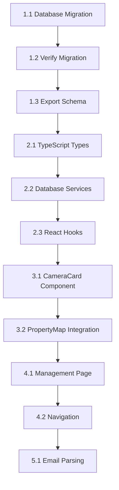

# Camera System Implementation Roadmap

## Overview

This document provides a step-by-step implementation plan for the three-table trail camera management system for Caswell County Yacht Club. Follow these steps in order to avoid getting lost in complexity.

**Goal**: Replace the basic `trail_cameras` table with a sophisticated three-table system supporting seasonal moves, smart alerts, and email report parsing.

## Three-Table System Architecture

```
camera_hardware (12 fields)
├── Physical camera devices and specifications
├── Device IDs from daily reports ("002", "013")
├── Brand, model, condition tracking
└── Offline detection fields

camera_deployments (14 fields) 
├── Where cameras are currently placed
├── Seasonal deployment tracking (2024, 2025)
├── Links to nearby stands
├── Solar panel configuration
└── Missing camera detection fields

camera_status_reports (11 fields)
├── Daily email report data
├── Battery, signal, storage status
├── Automatic alert generation
├── Historical tracking
└── Report presence tracking
```

## Enhanced Schema for Missing Camera Detection

### Additional Fields for Offline Detection:

**camera_deployments table additions**:
- `last_seen_date` (date) - Last date this camera appeared in a report
- `missing_since_date` (date) - First date camera was noticed missing  
- `is_missing` (boolean) - Currently missing from reports
- `consecutive_missing_days` (integer) - Days missing in a row

**camera_status_reports table additions**:
- `report_processing_date` (timestamptz) - When we processed this report (vs when camera sent data)

### Missing Camera Logic:
1. **Daily Report Processing**: Track which cameras appear in each report
2. **Missing Detection**: Flag cameras that were in yesterday's report but not today's
3. **Alert Generation**: Create alerts for cameras missing 2+ consecutive days
4. **Investigation Tracking**: Mark cameras as "under investigation" when missing

### Git Workflow Commands

**Initial setup**:
```bash
git checkout main
git pull origin main
git checkout -b feature/camera-management-system
```

**Daily work session start**:
```bash
git checkout feature/camera-management-system
git status  # Check where you left off
```

**Commit progress** (after each step):
```bash
git add .
git commit -m "step-X.Y: [description from roadmap]"
git push origin feature/camera-management-system
```

**Merge to main** (end of each phase, for Claude to see progress):
```bash
git checkout main
git pull origin main
git merge feature/camera-management-system
git push origin main
git checkout feature/camera-management-system
```

**Resume work** (Claude can see your progress):
> "I'm resuming camera system implementation. I completed up to [Phase X, Step Y]. Here's my current progress: [list completed items]. Ready to continue with Step [X.Y]."

**Final cleanup** (when entire feature complete):
```bash
git checkout main
git branch -d feature/camera-management-system
git push origin --delete feature/camera-management-system
```

## Start/Stop Guidance

### **Recommended Stopping Points**
- ✅ **After Phase 1**: Core database structure in place
- ✅ **After Phase 2**: TypeScript foundation ready for development  
- ✅ **After Phase 3**: Components working, can display cameras on map
- ✅ **After Phase 4**: Full camera management system functional
- ✅ **After Phase 5**: Email processing implemented (future)

### **Resuming Work Sessions**
1. **Check your git branch**: `git status` and `git log --oneline -5`
2. **Review this roadmap**: Find your last completed step
3. **Check progress section**: Update checkboxes below
4. **Prompt Claude**: Use the resume prompt above with your current status

### **Natural Break Points**
- **End of each step**: Safe to stop, clear commit message
- **End of each phase**: Merge to main, Claude can see progress
- **Before major changes**: Create backup branch if needed

## Implementation Checklist

### Phase 1: Database Foundation ✅ READY
- [ ] **Step 1.1**: Run database migration
- [ ] **Step 1.2**: Verify migration success  
- [ ] **Step 1.3**: Export updated schema
- [ ] **Step 1.4**: Update documentation
- [ ] **Step 1.5**: Commit and merge to main

### Phase 2: TypeScript Foundation ✅ READY
- [ ] **Step 2.1**: Add camera type definitions
- [ ] **Step 2.2**: Create database service layer
- [ ] **Step 2.3**: Create React hooks
- [ ] **Step 2.4**: Test type safety
- [ ] **Step 2.5**: Commit and merge to main

### Phase 3: Core Components ✅ READY
- [ ] **Step 3.1**: Build CameraCard component
- [ ] **Step 3.2**: Update PropertyMap integration
- [ ] **Step 3.3**: Test component rendering
- [ ] **Step 3.4**: Verify popup behavior
- [ ] **Step 3.5**: Commit and merge to main

### Phase 4: Management Interface ✅ READY
- [ ] **Step 4.1**: Create camera management page
- [ ] **Step 4.2**: Add navigation integration
- [ ] **Step 4.3**: Test CRUD operations
- [ ] **Step 4.4**: Verify filtering and stats
- [ ] **Step 4.5**: Commit and merge to main

### Phase 5: Email Processing 🔄 FUTURE
- [ ] **Step 5.1**: Build email parsing logic
- [ ] **Step 5.2**: Create manual upload interface
- [ ] **Step 5.3**: Implement smart alerts
- [ ] **Step 5.4**: Add error handling
- [ ] **Step 5.5**: Commit and merge to main

### Phase 6: Testing & Refinement 🔄 FUTURE
- [ ] **Step 6.1**: End-to-end testing
- [ ] **Step 6.2**: Performance optimization
- [ ] **Step 6.3**: User acceptance testing
- [ ] **Step 6.4**: Documentation updates
- [ ] **Step 6.5**: Final commit and merge

---

## Database Modification Tracking System

### Recommended Documentation Structure

Based on your current `docs/database/` and `WORKFLOW.md`, I recommend this enhanced structure:

```
docs/
├── database/
│   ├── SCHEMA.md                    # Current complete schema documentation
│   ├── migrations.md                # Detailed migration history (enhanced)
│   ├── camera-system.md            # Camera-specific schema documentation
│   └── missing-detection.md        # Missing camera detection logic
├── implementation/
│   └── camera-system-implementation.md # This roadmap
└── WORKFLOW.md                      # Enhanced with database procedures
```

### Enhanced WORKFLOW.md Section

**Add this section to your WORKFLOW.md**:

```markdown
## Database Modification Workflow

### Before Making Schema Changes
1. **Document the change**: Add entry to `docs/database/migrations.md`
2. **Create feature branch**: `git checkout -b feature/db-[change-name]`
3. **Backup critical data**: Export from Supabase if needed
4. **Test in development**: Use Supabase staging if available

### Making Schema Changes
1. **Write migration SQL**: Include rollback procedures
2. **Update schema docs**: Modify `docs/database/SCHEMA.md`
3. **Test migration**: Verify all constraints and triggers work
4. **Export schema**: Run `npm run db:export`

### After Schema Changes
1. **Commit changes**: Include migration, docs, and exported schema
2. **Merge to main**: So Claude can see current structure
3. **Update team**: Document breaking changes if any
4. **Monitor**: Watch for issues in production

### For Claude Integration
- **Always merge schema changes to main** before asking Claude for code
- **Include current schema** in conversation context when needed
- **Reference migration entries** when explaining database structure
- **Export schema after every change**: `npm run db:export`
```

### Enhanced migrations.md Format

**Update your `docs/database/migrations.md` to include**:

```markdown
# Database Migrations Log

## Migration Format Template
```
### [Feature Name] - [Date]
**Type**: Schema Addition | Schema Modification | Data Migration | Performance
**Affected Tables**: table1, table2, table3
**Breaking Changes**: Yes/No
**Rollback Available**: Yes/No

**Purpose**: Brief description of why this change was needed

**Changes Made**:
- Added table `new_table` with fields: field1, field2, field3
- Modified table `existing_table`: added field4, removed field5
- Added indexes: idx_name1, idx_name2
- Added triggers: trigger_name

**Migration SQL**: 
```sql
-- SQL commands used
```

**Verification Steps**:
- [ ] Verification step 1
- [ ] Verification step 2

**Files Modified**:
- supabase/schema.sql (exported)
- docs/database/SCHEMA.md (if structure changed)
- src/types/database.ts (if types changed)

**Claude Context**: Include this migration when asking Claude about [specific feature]
```

### Current Schema Documentation

**Create/update `docs/database/SCHEMA.md`** with current structure:

```markdown
# Database Schema Documentation

## Camera Management System (Latest)

### camera_hardware (12 fields)
Physical camera devices and specifications
- id (uuid, PK)
- device_id (varchar(10), unique) - From daily reports  
- brand, model, serial_number
- purchase_date, fw_version, cl_version
- condition (good|questionable|poor|retired)
- active (boolean)
- notes, created_at, updated_at

### camera_deployments (14 fields)  
Where cameras are currently placed
- id (uuid, PK)
- hardware_id (FK to camera_hardware)
- location_name (varchar(100)) - Human readable location
- latitude, longitude (numeric)
- season_year (integer) - 2024, 2025, etc.
- stand_id (FK to stands, optional)
- facing_direction (N|NE|E|SE|S|SW|W|NW)
- has_solar_panel (boolean) - Critical for battery alerts
- active (boolean)
- notes
- **Missing Detection Fields**:
  - last_seen_date - Last appearance in report
  - missing_since_date - First noticed missing
  - is_missing (boolean) - Currently missing
  - consecutive_missing_days (integer)
- created_at, updated_at

### camera_status_reports (11 fields)
Daily email report data
- id (uuid, PK)  
- deployment_id (FK to camera_deployments)
- hardware_id (FK to camera_hardware)
- report_date (date)
- battery_status, signal_level, network_links
- sd_images_count, sd_free_space_mb, image_queue
- needs_attention (boolean), alert_reason (text)
- report_processing_date - When we processed the report
- created_at

### Key Relationships
- camera_hardware → camera_deployments (one-to-many)
- camera_deployments → camera_status_reports (one-to-many)  
- stands → camera_deployments (one-to-many, optional)

### Alert Logic
- Automatic via trigger on status report insert/update
- Missing camera detection via daily function call
- Solar panel issue detection
- Storage and connectivity alerts

### Indexes
- Performance indexes on commonly queried fields
- Special indexes for missing camera detection
- Alert-specific indexes for dashboard queries
```

## Detailed Implementation Steps

### Phase 1: Database Foundation

#### Step 1.1: Run Database Migration
**Location**: Supabase SQL Editor
**Pre-requisites**: 
```bash
# Start feature branch
git checkout main
git pull origin main
git checkout -b feature/camera-management-system
```

**Actions**:
1. **Backup existing data**: Export current `trail_cameras` table from Supabase
2. **Clean existing camera data**: Remove placeholder trail_cameras data
3. **Run enhanced migration SQL**: Include missing camera detection fields
4. **Execute in Supabase**: Paste and run in SQL Editor

**Enhanced Migration SQL** (updated from previous conversation):
```sql
-- Camera Management System Migration with Missing Detection
-- Replace basic trail_cameras table with enhanced three-table design
BEGIN;

-- Step 1: Backup and clean existing data
CREATE TABLE trail_cameras_backup AS SELECT * FROM trail_cameras;
DROP TABLE trail_cameras CASCADE; -- Remove old table and dependencies

-- Step 2: Create enhanced camera_hardware table (12 fields)
CREATE TABLE camera_hardware (
  id uuid PRIMARY KEY DEFAULT gen_random_uuid(),
  device_id varchar(10) NOT NULL UNIQUE,  -- "002", "013" from daily reports
  brand varchar(50),                       -- "CuddeLink", "Reconyx"
  model varchar(50),                       -- "J-2", "LL2A", "G-2+"
  serial_number varchar(100),
  purchase_date date,
  fw_version varchar(20),                  -- "8.3.0", "1.7.0"
  cl_version varchar(30),                  -- "1.0.44 / 5.5.11"
  condition varchar(20) DEFAULT 'good',    -- good, questionable, poor, retired
  active boolean DEFAULT true,
  notes text,
  created_at timestamptz DEFAULT now(),
  updated_at timestamptz DEFAULT now()
);

-- Step 3: Create enhanced camera_deployments table (14 fields)
CREATE TABLE camera_deployments (
  id uuid PRIMARY KEY DEFAULT gen_random_uuid(),
  hardware_id uuid REFERENCES camera_hardware(id) ON DELETE RESTRICT,
  location_name varchar(100) NOT NULL,     -- "DAM ROAD", "SHIT STAND FIELD"
  latitude numeric(10,8) NOT NULL,
  longitude numeric(11,8) NOT NULL,
  season_year integer,                     -- 2024, 2025
  stand_id uuid REFERENCES stands(id) ON DELETE SET NULL,
  facing_direction varchar(10),            -- "N", "SW", "E"
  has_solar_panel boolean DEFAULT false,   -- CRITICAL for battery validation
  active boolean DEFAULT true,
  notes text,
  -- Missing camera detection fields
  last_seen_date date,                     -- Last date in email report
  missing_since_date date,                 -- First date noticed missing
  is_missing boolean DEFAULT false,        -- Currently missing from reports
  consecutive_missing_days integer DEFAULT 0, -- Days missing in a row
  created_at timestamptz DEFAULT now(),
  updated_at timestamptz DEFAULT now()
);

-- Step 4: Create enhanced camera_status_reports table (11 fields)  
CREATE TABLE camera_status_reports (
  id uuid PRIMARY KEY DEFAULT gen_random_uuid(),
  deployment_id uuid REFERENCES camera_deployments(id) ON DELETE CASCADE,
  hardware_id uuid REFERENCES camera_hardware(id) ON DELETE CASCADE,
  report_date date NOT NULL,
  battery_status varchar(20),              -- "Ext OK", "Low", "Ext-2 Low"
  signal_level integer,                    -- 0-99
  network_links integer,                   -- Mesh network behavior
  sd_images_count integer,                 -- Total photos stored
  sd_free_space_mb integer,                -- Available storage
  image_queue integer,                     -- Pending uploads
  needs_attention boolean DEFAULT false,
  alert_reason text,
  report_processing_date timestamptz DEFAULT now(), -- When we processed report
  created_at timestamptz DEFAULT now()
);

-- Step 5: Add indexes for performance (including missing detection)
CREATE INDEX idx_camera_hardware_device_id ON camera_hardware(device_id);
CREATE INDEX idx_camera_hardware_active ON camera_hardware(active);

CREATE INDEX idx_camera_deployments_hardware ON camera_deployments(hardware_id);
CREATE INDEX idx_camera_deployments_location ON camera_deployments(location_name);
CREATE INDEX idx_camera_deployments_coords ON camera_deployments(latitude, longitude);
CREATE INDEX idx_camera_deployments_active ON camera_deployments(active);
CREATE INDEX idx_camera_deployments_season ON camera_deployments(season_year);
CREATE INDEX idx_camera_deployments_missing ON camera_deployments(is_missing) WHERE is_missing = true;
CREATE INDEX idx_camera_deployments_last_seen ON camera_deployments(last_seen_date);

CREATE INDEX idx_camera_status_deployment ON camera_status_reports(deployment_id);
CREATE INDEX idx_camera_status_hardware ON camera_status_reports(hardware_id);
CREATE INDEX idx_camera_status_date ON camera_status_reports(report_date);
CREATE INDEX idx_camera_status_alerts ON camera_status_reports(needs_attention) WHERE needs_attention = true;

-- Step 6: Enhanced alert trigger with missing detection
CREATE OR REPLACE FUNCTION update_camera_alert_status()
RETURNS TRIGGER AS $
BEGIN
  -- Reset alert status
  NEW.needs_attention := false;
  NEW.alert_reason := NULL;
  
  -- Check for alert conditions
  IF NEW.battery_status LIKE '%Low%' THEN
    NEW.needs_attention := true;
    NEW.alert_reason := 'Low battery detected';
  ELSIF NEW.image_queue > 5 THEN
    NEW.needs_attention := true;
    NEW.alert_reason := 'Image queue backup - check connectivity';
  ELSIF NEW.sd_free_space_mb IS NOT NULL AND NEW.sd_free_space_mb < 1000 THEN
    NEW.needs_attention := true;
    NEW.alert_reason := 'Storage nearly full - less than 1GB remaining';
  ELSE
    -- Check solar panel issues
    DECLARE
      has_solar boolean;
    BEGIN
      SELECT has_solar_panel INTO has_solar 
      FROM camera_deployments 
      WHERE id = NEW.deployment_id;
      
      IF has_solar = true AND NEW.battery_status = 'OK' THEN
        NEW.needs_attention := true;
        NEW.alert_reason := 'Solar panel issue - should show "Ext OK" not "OK"';
      END IF;
    END;
  END IF;
  
  -- Update deployment last_seen_date and reset missing status
  UPDATE camera_deployments 
  SET 
    last_seen_date = NEW.report_date,
    is_missing = false,
    missing_since_date = NULL,
    consecutive_missing_days = 0
  WHERE id = NEW.deployment_id;
  
  RETURN NEW;
END;
$ LANGUAGE plpgsql;

-- Step 7: Function to detect missing cameras (call daily after report processing)
CREATE OR REPLACE FUNCTION detect_missing_cameras(processing_date date)
RETURNS void AS $
BEGIN
  -- Mark cameras as missing if they were active yesterday but not in today's report
  UPDATE camera_deployments 
  SET 
    is_missing = true,
    missing_since_date = COALESCE(missing_since_date, processing_date),
    consecutive_missing_days = consecutive_missing_days + 1
  WHERE active = true 
    AND (last_seen_date < processing_date - INTERVAL '1 day' OR last_seen_date IS NULL)
    AND NOT EXISTS (
      SELECT 1 FROM camera_status_reports 
      WHERE deployment_id = camera_deployments.id 
      AND report_date = processing_date
    );
    
  -- Create alerts for cameras missing 2+ days
  INSERT INTO camera_status_reports (
    deployment_id, 
    hardware_id, 
    report_date, 
    needs_attention, 
    alert_reason,
    report_processing_date
  )
  SELECT 
    cd.id,
    cd.hardware_id,
    processing_date,
    true,
    'Camera missing from reports for ' || cd.consecutive_missing_days || ' day(s)',
    now()
  FROM camera_deployments cd
  WHERE cd.is_missing = true 
    AND cd.consecutive_missing_days >= 2
    AND NOT EXISTS (
      SELECT 1 FROM camera_status_reports csr
      WHERE csr.deployment_id = cd.id 
      AND csr.report_date = processing_date
    );
END;
$ LANGUAGE plpgsql;

-- Rest of migration (RLS, views, etc.) same as before...
-- [Include remaining steps from previous migration]

COMMIT;
```

**Verification checklist**:
- [ ] All three tables created with enhanced fields
- [ ] Missing detection indexes created
- [ ] Alert trigger function updated
- [ ] Missing detection function created
- [ ] Old trail_cameras table removed
- [ ] Backup table created successfully

**Git commands**:
```bash
git add .
git commit -m "step-1.1: run enhanced database migration with missing detection"
git push origin feature/camera-management-system
```

**How to prompt Claude**:
> "I've run the enhanced database migration. I can see the three new camera tables with missing detection fields in Supabase. Old trail_cameras table removed. Ready for Step 1.2."

#### Step 1.2: Verify Migration Success
**Actions - Run these verification queries in Supabase**:
```sql
-- Check tables exist with correct field counts
SELECT 
  table_name,
  (SELECT COUNT(*) FROM information_schema.columns 
   WHERE table_name = t.table_name AND table_schema = 'public') as field_count
FROM information_schema.tables t
WHERE table_schema = 'public' 
AND table_name LIKE 'camera_%'
ORDER BY table_name;

-- Expected results:
-- camera_hardware: 12 fields
-- camera_deployments: 14 fields  
-- camera_status_reports: 11 fields

-- Check missing detection fields exist
SELECT column_name, data_type 
FROM information_schema.columns 
WHERE table_name = 'camera_deployments' 
AND column_name IN ('last_seen_date', 'missing_since_date', 'is_missing', 'consecutive_missing_days');

-- Check functions exist
SELECT proname FROM pg_proc WHERE proname IN ('update_camera_alert_status', 'detect_missing_cameras');

-- Check indexes exist (missing detection specific)
SELECT indexname FROM pg_indexes 
WHERE tablename LIKE 'camera_%' 
AND indexname LIKE '%missing%';

-- Test missing detection function (safe test)
SELECT detect_missing_cameras(CURRENT_DATE);

-- Test alert trigger with sample data
INSERT INTO camera_hardware (device_id, brand, model) 
VALUES ('TEST001', 'Test Brand', 'Test Model');

INSERT INTO camera_deployments (hardware_id, location_name, latitude, longitude, has_solar_panel)
SELECT id, 'TEST LOCATION', 36.427, -79.511, true
FROM camera_hardware WHERE device_id = 'TEST001';

INSERT INTO camera_status_reports (deployment_id, hardware_id, report_date, battery_status, image_queue)
SELECT cd.id, cd.hardware_id, CURRENT_DATE, 'Low', 8
FROM camera_deployments cd 
JOIN camera_hardware ch ON cd.hardware_id = ch.id
WHERE ch.device_id = 'TEST001';

-- Verify alert was triggered
SELECT needs_attention, alert_reason 
FROM camera_status_reports csr
JOIN camera_deployments cd ON csr.deployment_id = cd.id
JOIN camera_hardware ch ON cd.hardware_id = ch.id
WHERE ch.device_id = 'TEST001';

-- Verify last_seen_date was updated
SELECT last_seen_date, is_missing, consecutive_missing_days
FROM camera_deployments cd
JOIN camera_hardware ch ON cd.hardware_id = ch.id
WHERE ch.device_id = 'TEST001';

-- Clean up test data
DELETE FROM camera_status_reports 
WHERE deployment_id IN (
  SELECT cd.id FROM camera_deployments cd
  JOIN camera_hardware ch ON cd.hardware_id = ch.id
  WHERE ch.device_id = 'TEST001'
);

DELETE FROM camera_deployments 
WHERE hardware_id IN (SELECT id FROM camera_hardware WHERE device_id = 'TEST001');

DELETE FROM camera_hardware WHERE device_id = 'TEST001';

-- Check backup table exists
SELECT COUNT(*) as backed_up_records FROM trail_cameras_backup;
```

**Expected results**:
- 3 camera tables with correct field counts
- Missing detection fields present in camera_deployments
- Both functions exist in database
- Missing detection indexes created
- Test trigger works (needs_attention = true, alert_reason includes "Low battery")
- Last_seen_date updated to today, is_missing = false
- Backup table contains original trail_cameras data

**Git commands**:
```bash
git add .
git commit -m "step-1.2: verify enhanced migration with missing detection"
git push origin feature/camera-management-system
```

**How to prompt Claude**:
> "Enhanced migration verification complete. All three camera tables exist with correct field counts. Missing detection fields present. Alert trigger and missing detection function work correctly. Backup table preserved. Ready for Step 1.3."

#### Step 1.3: Export Updated Schema
**Commands**:
```bash
npm run db:export
git add supabase/schema.sql
git commit -m "step-1.3: export updated schema with camera tables"
git push origin feature/camera-management-system
```

**Verification**: Check that `supabase/schema.sql` contains the new camera table definitions.

**How to prompt Claude**:
> "Schema exported and committed. supabase/schema.sql updated. Ready for Step 1.4."

#### Step 1.4: Update Documentation  
**Files to create/update**:
- `docs/database/migrations.md` (add camera system entry)
- `docs/database/SCHEMA.md` (update with camera tables)
- `docs/database/camera-system.md` (create new)
- `WORKFLOW.md` (add database modification section)

**1. Add to `docs/database/migrations.md`**:
```markdown
### Camera Management System - [Today's Date]

**Type**: Schema Addition  
**Affected Tables**: camera_hardware, camera_deployments, camera_status_reports  
**Breaking Changes**: Yes (removed trail_cameras table)  
**Rollback Available**: Yes (via trail_cameras_backup table for 7 days)

**Purpose**: Replace basic trail_cameras table with sophisticated three-table system supporting seasonal moves, smart alerts, missing camera detection, and email report parsing.

**Changes Made**:
- **Removed**: trail_cameras table (backed up as trail_cameras_backup)
- **Added**: camera_hardware table (12 fields) - Physical device inventory
- **Added**: camera_deployments table (14 fields) - Location and seasonal tracking  
- **Added**: camera_status_reports table (11 fields) - Daily report data with alerts
- **Added**: Missing detection fields: last_seen_date, missing_since_date, is_missing, consecutive_missing_days
- **Added**: Automatic alert triggers for battery, storage, connectivity issues
- **Added**: Missing camera detection function detect_missing_cameras()
- **Added**: Solar panel monitoring and issue detection
- **Added**: Performance indexes for queries and missing detection
- **Added**: Row Level Security (RLS) policies

**Migration SQL**: 
[Full SQL provided in implementation roadmap step 1.1]

**Verification Steps**:
- [X] All three camera tables created successfully
- [X] Missing detection indexes functional  
- [X] Alert trigger works for battery/storage/connectivity
- [X] Missing camera detection function operational
- [X] Old trail_cameras table removed, backup retained
- [X] RLS policies active

**Files Modified**:
- supabase/schema.sql (exported after migration)
- docs/database/SCHEMA.md (updated with camera system)
- docs/database/camera-system.md (created)
- src/lib/cameras/types.ts (created)
- WORKFLOW.md (enhanced database procedures)

**Claude Context**: Include this migration when asking Claude about camera system, missing detection, or alert logic. Essential for understanding the three-table relationship and missing camera workflows.

**Key Business Logic**:
- Cameras can move between seasons (same location, different hardware)
- Missing detection runs daily after report processing
- Solar panels should show "Ext OK" not "OK" for battery status
- Alert priorities: Missing > Battery Low > Storage Low > Connectivity Issues
- Deployment deactivation preserves historical data
```

**2. Update `WORKFLOW.md`** (add the database modification section from the tracking system above)

**3. Create `docs/database/SCHEMA.md`** (use the current schema documentation from tracking system above)

**4. Create `docs/database/camera-system.md`**:
```markdown
# Camera System Detailed Documentation

## Overview
Three-table system designed for seasonal camera management with missing detection.

## Missing Camera Detection Logic

### Daily Processing Workflow
1. **Process Email Report**: Parse HTML and insert status records
2. **Update Last Seen**: Trigger automatically updates last_seen_date
3. **Detect Missing**: Call detect_missing_cameras() function 
4. **Generate Alerts**: Create alert records for missing cameras
5. **Dashboard Update**: Missing cameras appear in alerts tab

### Missing Detection Rules
- **Trigger**: Camera in yesterday's report but not in today's
- **Grace Period**: 1 day (no alert on first missing day)
- **Alert Threshold**: 2+ consecutive missing days
- **Reset**: Camera reappears → reset missing flags

### Investigation Workflow
1. **Alert Generated**: "Camera missing from reports for X day(s)"
2. **Check Physical**: Visit camera location
3. **Common Issues**: Dead battery, SD card full, theft, damage
4. **Resolution**: Fix issue OR mark as deactivated if permanent

## Email Report Processing

### Current Status (Manual)
- Daily reports arrive as HTML emails
- Manual data entry into status_reports table
- Missing detection runs manually

### Future Status (Automated - Phase 5)
- Automated email parsing and import
- Daily scheduled missing detection
- Automatic alert notifications

## Alert Priority System
1. **Missing Cameras** (Critical) - Investigate immediately
2. **Battery Low** (High) - Replace batteries soon  
3. **Storage Full** (Medium) - Clear SD cards
4. **Connectivity Issues** (Low) - Check antenna/position
5. **Solar Panel Issues** (Medium) - Check connections

## Seasonal Workflow
1. **Season End**: Deactivate deployments (active = false)
2. **Camera Retrieval**: Update location notes with storage info
3. **Season Start**: Create new deployments for camera moves
4. **Historical Data**: Previous deployments preserved for analysis
```

**Git commands**:
```bash
mkdir -p docs/database
# Create/update all the documentation files above
git add docs/ WORKFLOW.md
git commit -m "step-1.4: comprehensive documentation update for camera system"
git push origin feature/camera-management-system
```

**How to prompt Claude**:
> "Documentation updated. Added camera system to migrations.md, updated SCHEMA.md, created camera-system.md, and enhanced WORKFLOW.md with database procedures. Ready for Step 1.5."

#### Step 1.5: Commit and Merge to Main
**Commands**:
```bash
# Merge to main so Claude can see progress
git checkout main
git pull origin main
git merge feature/camera-management-system
git push origin main
git checkout feature/camera-management-system
```

**How to prompt Claude**:
> "Phase 1 complete. Database foundation merged to main. Ready for Phase 2, Step 2.1."

---

### Phase 2: TypeScript Foundation

#### Step 2.1: Add Camera Type Definitions
**File**: `src/lib/cameras/types.ts`
**Action**: Create the file with enhanced types including missing detection fields

**Enhanced TypeScript Types** (includes missing detection):
```typescript
// Camera Deployment interface with missing detection
export interface CameraDeployment {
  id: string
  hardware_id: string
  location_name: string
  latitude: number
  longitude: number
  season_year: number | null
  stand_id: string | null
  facing_direction: FacingDirection | null
  has_solar_panel: boolean
  active: boolean
  notes: string | null
  // Missing detection fields
  last_seen_date: string | null      // ISO date string
  missing_since_date: string | null  // ISO date string  
  is_missing: boolean
  consecutive_missing_days: number
  created_at: string
  updated_at: string
}

// Camera Status Report with processing date
export interface CameraStatusReport {
  id: string
  deployment_id: string
  hardware_id: string
  report_date: string               // ISO date string
  battery_status: BatteryStatus | null
  signal_level: number | null
  network_links: number | null
  sd_images_count: number | null
  sd_free_space_mb: number | null
  image_queue: number | null
  needs_attention: boolean
  alert_reason: string | null
  report_processing_date: string    // When we processed the report
  created_at: string
}

// Missing camera alert types
export interface MissingCameraAlert {
  deployment_id: string
  location_name: string
  device_id: string
  last_seen_date: string | null
  missing_since_date: string | null
  consecutive_missing_days: number
  investigation_notes?: string
}

// Enhanced camera statistics
export interface CameraStats {
  total_hardware: number
  active_deployments: number
  cameras_with_alerts: number
  missing_cameras: number           // New
  average_battery_level: number
  total_photos_stored: number
  cameras_by_brand: Record<string, number>
  deployments_by_season: Record<number, number>
  alerts_by_type: Record<string, number>
  missing_by_days: Record<number, number>  // New: missing 1 day, 2 days, etc.
}
```

**File content**: Use the enhanced types with missing detection fields included

**Commands**:
```bash
mkdir -p src/lib/cameras
# Create src/lib/cameras/types.ts with the enhanced types content
git add src/lib/cameras/types.ts
git commit -m "step-2.1: add enhanced camera types with missing detection"
git push origin feature/camera-management-system
```

**Verification**: 
```bash
# Test TypeScript compilation
npm run build
# Should compile without errors
```

**How to prompt Claude**:
> "I've added the enhanced camera types file at src/lib/cameras/types.ts with missing detection fields. TypeScript compiles successfully. Ready for Step 2.2."

#### Step 2.2: Create Database Service Layer
**File**: `src/lib/cameras/database.ts`

**Commands to prompt Claude**:
> "I need the database service layer for cameras. Please create src/lib/cameras/database.ts with CRUD operations for camera_hardware, camera_deployments, and camera_status_reports. Include functions like getCameras, createHardware, updateDeployment, addStatusReport, etc."

**Expected functions needed**:
- `getCameraDeployments()` - Get all active deployments with hardware info
- `getCameraAlerts()` - Get cameras needing attention  
- `createCameraHardware(data)` - Add new camera device
- `updateCameraHardware(id, data)` - Update camera specs
- `createCameraDeployment(data)` - Deploy camera to location
- `updateCameraDeployment(id, data)` - Move camera or update config
- `addStatusReport(data)` - Add daily status data
- `getCameraStats()` - Calculate dashboard statistics

**Git commands** (after Claude provides the file):
```bash
git add src/lib/cameras/database.ts
git commit -m "step-2.2: add camera database service layer"
git push origin feature/camera-management-system
```

**How to prompt Claude**:
> "Database service layer added. Ready for Step 2.3."

#### Step 2.3: Create React Hooks
**File**: `src/lib/cameras/hooks.ts`

**Command to prompt Claude**:
> "I need React hooks for camera management. Please create src/lib/cameras/hooks.ts with hooks like useCameras, useCameraAlerts, useCameraStats that use the database functions from database.ts."

**Expected hooks needed**:
- `useCameras()` - Load and manage camera deployments
- `useCameraAlerts()` - Load cameras needing attention
- `useCameraStats()` - Load dashboard statistics  
- `useCamera(id)` - Load single camera with status
- `useCameraHardware()` - Manage hardware inventory

**Git commands** (after Claude provides the file):
```bash
git add src/lib/cameras/hooks.ts
git commit -m "step-2.3: add camera React hooks"
git push origin feature/camera-management-system
```

**How to prompt Claude**:
> "Camera hooks added. Ready for Step 2.4."

#### Step 2.4: Test Type Safety
**File**: `src/components/cameras/TypeTest.tsx` (temporary test file)

**Action**: Create a simple component that imports and uses camera types to verify everything compiles

**Test component content**:
```typescript
// src/components/cameras/TypeTest.tsx
import { CameraDeploymentWithHardware, CameraAlert } from '@/lib/cameras/types'
import { useCameras } from '@/lib/cameras/hooks'

const TypeTest = () => {
  const { cameras, loading, error } = useCameras()
  
  return (
    <div>
      <h1>Camera Type Test</h1>
      <p>Cameras loaded: {cameras.length}</p>
      {loading && <p>Loading...</p>}
      {error && <p>Error: {error}</p>}
    </div>
  )
}

export default TypeTest
```

**Commands**:
```bash
mkdir -p src/components/cameras
# Create the test component
npm run build  # Should compile successfully
git add src/components/cameras/TypeTest.tsx
git commit -m "step-2.4: add type safety test component"
git push origin feature/camera-management-system
```

**How to prompt Claude**:
> "Type safety test complete. TypeScript compiles successfully with all camera types and hooks. Ready for Step 2.5."

#### Step 2.5: Commit and Merge to Main
**Commands**:
```bash
git checkout main
git pull origin main
git merge feature/camera-management-system
git push origin main
git checkout feature/camera-management-system
```

**How to prompt Claude**:
> "Phase 2 complete. TypeScript foundation merged to main. Ready for Phase 3, Step 3.1."

---

### Phase 3: Core Components

#### Step 3.1: Build CameraCard Component
**File**: `src/components/cameras/CameraCard.tsx`
**Source**: Use the complete CameraCard component artifact from previous conversation

**Commands**:
```bash
# Create the component file with the artifact content
git add src/components/cameras/CameraCard.tsx
git commit -m "step-3.1: add CameraCard component"
git push origin feature/camera-management-system
```

**How to prompt Claude**:
> "I've added the CameraCard component at src/components/cameras/CameraCard.tsx. Ready for Step 3.2."

#### Step 3.2: Update PropertyMap Integration
**Choose your approach**:

**Option A**: Update existing PropertyMap
**How to prompt Claude**:
> "I want to update my existing PropertyMap component to integrate the new camera system. Here's my current PropertyMap file: [paste current src/components/PropertyMap.tsx or src/components/map/PropertyMap.tsx]. Please show me how to integrate the new camera system following the StandCard popup pattern."

**Option B**: Create new PropertyMap with cameras
**How to prompt Claude**:
> "I want to create a new PropertyMap component that includes the camera system. Please create src/components/map/PropertyMapWithCameras.tsx based on the artifact from our previous conversation, but adapted to work with my current project structure."

**After getting the updated component**:
```bash
git add src/components/map/ # or wherever your PropertyMap is
git commit -m "step-3.2: integrate camera system with PropertyMap"
git push origin feature/camera-management-system
```

**How to prompt Claude**:
> "PropertyMap integration complete. CameraCard popups work like StandCard popups. Ready for Step 3.3."

#### Step 3.3: Test Component Rendering
**File**: `src/app/camera-demo/page.tsx` (temporary test page)

**How to prompt Claude**:
> "I need a test page to verify CameraCard rendering with sample data. Please create src/app/camera-demo/page.tsx that shows CameraCard in all three modes (compact, full, popup) with mock camera data."

**After getting the demo page**:
```bash
mkdir -p src/app/camera-demo
# Add the demo page file
git add src/app/camera-demo/
git commit -m "step-3.3: add camera component demo page"
git push origin feature/camera-management-system
```

**Testing checklist**:
- [ ] Visit `/camera-demo` in browser
- [ ] Verify CameraCard renders in compact mode
- [ ] Verify CameraCard renders in full mode  
- [ ] Verify CameraCard renders in popup mode
- [ ] Check alert styling for cameras with issues
- [ ] Test click handlers and navigation buttons

**How to prompt Claude**:
> "Camera demo page working. All CameraCard modes render correctly. Ready for Step 3.4."

#### Step 3.4: Verify Popup Behavior
**Testing**: Open PropertyMap and test camera popups

**Actions**:
1. **Add test camera data** (via Supabase interface or demo data)
2. **Visit property map page**
3. **Verify camera markers appear**
4. **Click camera markers to test popups**
5. **Verify CameraCard displays correctly in popup**

**If you need test data**, prompt Claude:
> "I need some test camera data to verify popup behavior. Please provide INSERT statements for a few sample cameras that I can add to Supabase for testing."

**Git commands**:
```bash
git add .
git commit -m "step-3.4: verify camera popup behavior in PropertyMap"
git push origin feature/camera-management-system
```

**How to prompt Claude**:
> "Camera popup behavior verified. PropertyMap shows camera markers with working CameraCard popups. Ready for Step 3.5."

#### Step 3.5: Commit and Merge to Main
**Commands**:
```bash
git checkout main
git pull origin main  
git merge feature/camera-management-system
git push origin main
git checkout feature/camera-management-system
```

**How to prompt Claude**:
> "Phase 3 complete. Core components merged to main. Ready for Phase 4, Step 4.1."

---

### Phase 4: Management Interface

#### Step 4.1: Create Camera Management Page
**File**: `src/app/cameras/page.tsx`
**Source**: Use the camera management page artifact from previous conversation

**Commands**:
```bash
mkdir -p src/app/cameras
# Create page.tsx with the camera management content
git add src/app/cameras/page.tsx
git commit -m "step-4.1: add camera management page"
git push origin feature/camera-management-system
```

**How to prompt Claude**:
> "I've added the camera management page at src/app/cameras/page.tsx. Ready for Step 4.2."

#### Step 4.2: Add Navigation Integration
**Files to update**: Your main navigation component (likely in `src/components/` or `src/app/`)

**How to prompt Claude**:
> "I need to add camera management to my main navigation. Here's my current navigation component: [paste your navigation file]. Please show me how to add a camera management link that matches the existing style."

**Expected navigation item**:
- **Icon**: Camera icon
- **Label**: "Cameras" or "Trail Cameras"  
- **Link**: `/cameras`
- **Badge**: Show alert count if any cameras need attention

**After getting navigation update**:
```bash
git add [your-navigation-file]
git commit -m "step-4.2: add cameras link to main navigation"
git push origin feature/camera-management-system
```

**Testing**:
- [ ] Camera link appears in navigation
- [ ] Link goes to `/cameras` page
- [ ] Page loads without errors
- [ ] Navigation styling matches other items

**How to prompt Claude**:
> "Navigation integration complete. Camera management accessible from main nav. Ready for Step 4.3."

#### Step 4.3: Test CRUD Operations
**Testing checklist**:

**Hardware Management**:
- [ ] Can view camera hardware list
- [ ] Can add new camera hardware
- [ ] Can edit camera hardware details
- [ ] Can change camera condition status

**Deployment Management**:
- [ ] Can view active deployments  
- [ ] Can create new deployment
- [ ] Can update deployment location
- [ ] Can deactivate deployment for season end

**Status Reports**:
- [ ] Can view latest status for each camera
- [ ] Alerts display correctly
- [ ] Alert reasons are accurate

**If you encounter issues**, prompt Claude:
> "Having issues with [specific CRUD operation]. Here's the error: [paste error message]. Here's my current code: [paste relevant code section]."

**Git commands**:
```bash
git add .
git commit -m "step-4.3: test and verify CRUD operations"
git push origin feature/camera-management-system
```

**How to prompt Claude**:
> "CRUD operations working correctly. Can manage hardware, deployments, and view status reports. Ready for Step 4.4."

#### Step 4.4: Verify Filtering and Stats  
**Testing checklist**:

**Filters**:
- [ ] Active only filter works
- [ ] Has alerts filter works
- [ ] Brand filter works
- [ ] Season filter works
- [ ] Filters can be combined

**Statistics**:
- [ ] Active deployments count correct
- [ ] Alert count accurate
- [ ] Average battery level calculated
- [ ] Total photos count accurate
- [ ] Brand breakdown correct

**Dashboard**:
- [ ] Stats cards display correctly
- [ ] Alert banner shows when cameras need attention
- [ ] Tab navigation works (Deployments, Hardware, Alerts, Reports)

**If stats are incorrect**, prompt Claude:
> "Statistics calculation seems wrong. Expected [X] but showing [Y]. Here's my current data: [describe current camera data]."

**Git commands**:
```bash
git add .
git commit -m "step-4.4: verify filtering and statistics accuracy"
git push origin feature/camera-management-system
```

**How to prompt Claude**:
> "Filtering and stats verification complete. All calculations accurate. Ready for Step 4.5."

#### Step 4.5: Commit and Merge to Main
**Commands**:
```bash
git checkout main
git pull origin main
git merge feature/camera-management-system
git push origin main
git checkout feature/camera-management-system
```

**How to prompt Claude**:
> "Phase 4 complete. Camera management interface merged to main. Core camera system is now functional. Ready for Phase 5 when needed, or we can stop here for now."

---

### Phase 5: Email Processing (Future)

#### Step 5.1: Build Email Parsing Logic
**How to prompt Claude**:
> "Ready to implement email parsing. Please create the email parsing logic based on the strategy document."

#### Step 5.2: Create Manual Upload Interface
**How to prompt Claude**:
> "Email parsing logic ready. Please create a manual upload interface for HTML email files."

#### Step 5.3: Implement Smart Alerts
**How to prompt Claude**:
> "Manual upload working. Please implement the smart alert logic for camera status reports."

#### Step 5.4: Add Error Handling
**How to prompt Claude**:
> "Smart alerts working. Please add comprehensive error handling for email parsing edge cases."

---

## File Structure

```
hunt-club/
├── docs/implementation/
│   └── camera-system-implementation.md    # This file
├── src/
│   ├── lib/cameras/
│   │   ├── types.ts                      # Step 2.1
│   │   ├── database.ts                   # Step 2.2
│   │   └── hooks.ts                      # Step 2.3
│   ├── components/cameras/
│   │   ├── CameraCard.tsx               # Step 3.1
│   │   └── CameraCardDemo.tsx           # Step 3.3
│   ├── components/map/
│   │   └── PropertyMapWithCameras.tsx   # Step 3.2 (optional)
│   └── app/cameras/
│       ├── page.tsx                     # Step 4.1
│       └── upload/
│           └── page.tsx                 # Step 5.2
└── supabase/
    └── schema.sql                       # Updated in Step 1.3
```

---

## Dependencies Between Steps



**Key Rule**: Never skip a step. Each step builds on the previous ones.

---

## Common Issues and Solutions

### Database Migration Issues
**Problem**: Migration fails with foreign key errors
**Solution**: Ensure all referenced tables exist first
**How to get help**: 
> "Migration failed with this error: [paste exact error]. Help me troubleshoot."

### TypeScript Compilation Errors
**Problem**: Import errors or type mismatches
**Solution**: Verify file paths and type definitions
**How to get help**:
> "Getting TypeScript error: [paste error]. Here's my current code: [paste code]."

### Component Rendering Issues
**Problem**: CameraCard not displaying correctly
**Solution**: Check data structure and prop passing
**How to get help**:
> "CameraCard not rendering. Here's my data: [paste sample data] and error: [paste error]."

---

## Progress Tracking

### Current Phase: ⏳ **Not Started**
- [ ] Phase 1: Database Foundation
- [ ] Phase 2: TypeScript Foundation  
- [ ] Phase 3: Core Components
- [ ] Phase 4: Management Interface
- [ ] Phase 5: Email Processing
- [ ] Phase 6: Testing & Refinement

### Update Instructions
**When completing a phase**:
1. Update the "Current Phase" section above
2. Check off completed items
3. Commit this file with your progress
4. Move to the next phase

### Git Workflow
```bash
# After each major step:
git add docs/implementation/camera-system-implementation.md
git commit -m "docs: update camera implementation progress - completed [Phase X.Y]"
git push origin main
```

---

## Emergency Procedures

### If You Get Stuck
1. **Check this document** for the exact step you're on
2. **Use the provided prompts** to ask Claude for help
3. **Include context**: current step, error messages, relevant code
4. **Never skip ahead** - each step builds on previous ones

### Rollback Procedures
- **Database**: Use Supabase backup/restore
- **Code**: Use git to revert to last working state
- **Components**: Comment out new code until issues resolved

### Getting Back on Track
If you lose track of where you are:
1. Check the progress tracking section above
2. Look at your most recent git commits
3. Ask Claude: "I lost track of camera implementation progress. Here's what I have so far: [list completed items]. Where should I continue?"

---

## Success Criteria

**Phase 1 Complete When**: All three camera tables exist in Supabase with proper constraints and triggers
**Phase 2 Complete When**: TypeScript compiles successfully with all camera types and services
**Phase 3 Complete When**: CameraCard displays correctly in PropertyMap with popups
**Phase 4 Complete When**: Full camera management interface works with CRUD operations
**Phase 5 Complete When**: Email reports can be parsed and imported successfully
**Phase 6 Complete When**: System is production-ready with full testing coverage

---

## Final Notes

- **Take breaks** between phases to avoid burnout
- **Test thoroughly** at each step before moving forward  
- **Ask questions** using the provided prompts - don't guess
- **Update progress** in this document as you go
- **Commit often** to save your work

This camera system will be significantly more sophisticated than the basic trail_cameras table. The investment in proper implementation will pay off with better data organization, automatic alerts, and seasonal deployment tracking.

**Remember**: Slow and steady wins the race. Follow the steps, use the prompts, and you'll have a robust camera management system.