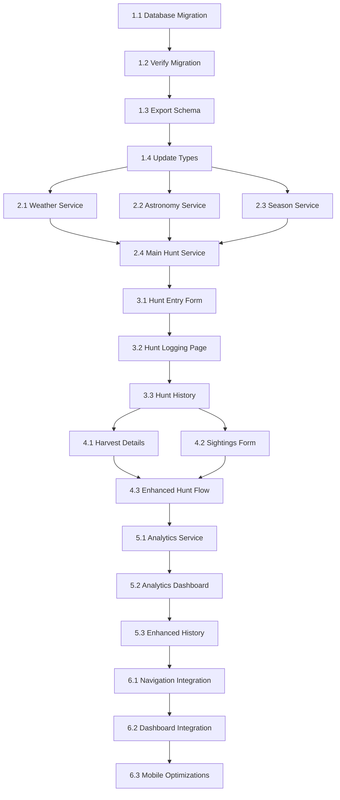

# Hunt Logging System - Implementation Plan

**Document Purpose**: Complete roadmap for implementing comprehensive hunt logging with auto-populated weather and astronomical data while maintaining simple user experience.

**Last Updated**: 2025-01-10  
**Status**: ⏳ **Phase 0 - Planning** (See progress tracking below)

---

## 🎯 **System Overview**

### **Core Philosophy**
- **User Input**: Minimal (5 fields, <30 seconds on mobile)
- **Auto-Population**: Maximum (weather, moon, seasons, calculations)
- **Data Richness**: Comprehensive analytics potential
- **Mobile-First**: Fast entry, beautiful display

### **User Experience Flow**
```
1. Quick Hunt Entry (30 seconds)
   ↓
2. Auto Weather/Astro Population (background)
   ↓  
3. Optional Harvest Details (if harvest = yes)
   ↓
4. Optional Sightings Log (any animals seen)
   ↓
5. Rich Analytics & History View
```

### **Key Data Capture Strategy**
| **User Enters** | **System Auto-Populates** |
|-----------------|----------------------------|
| Hunt date (default: today) | Weather from stand coordinates |
| AM/PM/All Day (buttons) | Moon phase & illumination |
| Stand location (dropdown) | Sunrise/sunset times |
| Had harvest? (toggle) | Hunt season from calendar |
| Notes (optional) | Property sector from stand |
| Optional exact times | Hunt duration calculations |

---

## 📋 **Implementation Phases**

### **Phase 1: Database Foundation** (Steps 1.1-1.4)
Create three new tables that integrate with existing schema
- `hunt_logs` (main hunt record) 
- `hunt_harvests` (detailed harvest info)
- `hunt_sightings` (animal sightings during hunt)

### **Phase 2: Auto-Population Services** (Steps 2.1-2.4)
Build services to populate weather and astronomical data
- Weather API integration (Visual Crossing)
- Moon phase calculations (SunCalc)
- Season detection from calendar
- Property sector mapping

### **Phase 3: Core Hunt Logging** (Steps 3.1-3.3)
Basic hunt entry form with auto-population
- Mobile-first hunt entry form
- Auto-population on submit
- Basic hunt history view

### **Phase 4: Harvest & Sightings** (Steps 4.1-4.3)
Enhanced data capture for successful hunts
- Harvest details form (if had_harvest = true)
- Sightings tracking (any animals seen)
- Photo upload integration

### **Phase 5: Analytics & History** (Steps 5.1-5.3)
Rich data display and analysis features
- Hunt success analytics
- Weather pattern correlations
- Stand effectiveness metrics

### **Phase 6: Integration & Polish** (Steps 6.1-6.3)
Connect with existing site features
- Navigation integration
- Dashboard widgets
- Mobile optimizations

---

## 🔧 **Implementation Steps**

### **Phase 1: Database Foundation**

#### **Step 1.1: Create Database Migration**
**What**: Add three new hunt logging tables to Supabase
**Files**: Direct Supabase dashboard work
**Dependencies**: Current database schema
```bash
# Before starting
git checkout main
git pull origin main
git checkout -b feature/hunt-logging-database
```
**Prompt Claude**: 
> "I'm ready for Step 1.1. Please provide the exact SQL migration to add hunt_logs, hunt_harvests, and hunt_sightings tables to my Supabase database. Include all indexes and triggers."

#### **Step 1.2: Verify Migration in Supabase**
**What**: Test tables were created correctly
**Action**: Check Supabase dashboard, verify relationships
**Prompt Claude**: 
> "Step 1.2 complete. Tables created successfully. Moving to Step 1.3."

#### **Step 1.3: Export Updated Schema**
**What**: Capture new schema in codebase
```bash
npm run db:export
git add supabase/
```
**Prompt Claude**: 
> "Step 1.3 complete. Schema exported. Here's my updated schema file: [attach supabase/schema.sql]"

#### **Step 1.4: Update TypeScript Types**
**What**: Add hunt logging types to database.ts
**Files**: `src/types/database.ts`
**Dependencies**: Step 1.3 complete
```bash
# Commit database changes before moving to code
git commit -m "db: add hunt logging tables (hunt_logs, hunt_harvests, hunt_sightings)

- Add comprehensive hunt tracking with auto-population fields
- Include weather, astronomical, and harvest detail capture
- Add indexes and triggers for performance
- Ready for service layer implementation"
```
**Prompt Claude**: 
> "Step 1.4 ready. Please update src/types/database.ts to include the new hunt logging table types. Here's my current database.ts file: [attach file]"

---

### **Phase 2: Auto-Population Services**

#### **Step 2.1: Weather Service Implementation**
**What**: Create weather API integration using Visual Crossing
**Files**: `src/lib/hunt-logging/weather-service.ts`
**Dependencies**: Weather API key in .env.local
```bash
# Add to .env.local
WEATHER_API_KEY=your_visual_crossing_key
```
**Prompt Claude**: 
> "Step 2.1 ready. Please create the weather service that fetches historical weather data using stand coordinates. I need the complete weather-service.ts file."

#### **Step 2.2: Astronomy Service Implementation**  
**What**: Moon phase and sun calculations using SunCalc
**Files**: `src/lib/hunt-logging/astronomy-service.ts`
**Dependencies**: SunCalc package installation
```bash
npm install suncalc
npm install --save-dev @types/suncalc
```
**Prompt Claude**: 
> "Step 2.2 ready. SunCalc installed. Please create the astronomy service for moon phase and sunrise/sunset calculations."

#### **Step 2.3: Season Detection Service**
**What**: Determine hunt season from calendar integration
**Files**: `src/lib/hunt-logging/season-service.ts`
**Dependencies**: Calendar system (future integration)
**Prompt Claude**: 
> "Step 2.3 ready. Please create a season service that determines hunting season from hunt date. For now, use hardcoded NC seasons but design for future calendar integration."

#### **Step 2.4: Main Hunt Logging Service**
**What**: Orchestrate all auto-population services
**Files**: `src/lib/hunt-logging/hunt-service.ts`
**Dependencies**: Steps 2.1-2.3 complete
**Prompt Claude**: 
> "Step 2.4 ready. All individual services created. Please create the main HuntLoggingService that orchestrates weather, astronomy, and season detection to auto-populate hunt data."

---

### **Phase 3: Core Hunt Logging**

#### **Step 3.1: Hunt Entry Form Component**
**What**: Mobile-first form for basic hunt entry
**Files**: `src/components/hunt-logging/HuntEntryForm.tsx`
**Dependencies**: react-hook-form, zod, Phase 2 services
```bash
# Install form dependencies if not already present
npm install react-hook-form @hookform/resolvers zod
```
**Prompt Claude**: 
> "Step 3.1 ready. Please create the mobile-first hunt entry form component with minimal required fields and auto-population integration."

#### **Step 3.2: Hunt Logging Page**
**What**: Main page for hunt logging
**Files**: `src/app/hunt-logging/page.tsx`
**Dependencies**: Step 3.1 complete
**Prompt Claude**: 
> "Step 3.2 ready. Please create the hunt logging page that uses the HuntEntryForm component."

#### **Step 3.3: Basic Hunt History View**
**What**: Display recent hunts with auto-populated data
**Files**: `src/components/hunt-logging/HuntHistory.tsx`
**Dependencies**: Hunt logging service
**Prompt Claude**: 
> "Step 3.3 ready. Please create a basic hunt history component to display recent hunts and verify auto-population is working."

---

### **Phase 4: Harvest & Sightings**

#### **Step 4.1: Harvest Details Form**
**What**: Detailed form shown when had_harvest = true
**Files**: `src/components/hunt-logging/HarvestDetailsForm.tsx`
**Dependencies**: Phase 3 complete
**Prompt Claude**: 
> "Step 4.1 ready. Please create the harvest details form that appears when user indicates they had a harvest."

#### **Step 4.2: Sightings Tracking Component**
**What**: Log animal sightings during hunt
**Files**: `src/components/hunt-logging/SightingsForm.tsx`
**Dependencies**: Phase 3 complete
**Prompt Claude**: 
> "Step 4.2 ready. Please create the sightings tracking component for logging animals seen during hunt."

#### **Step 4.3: Enhanced Hunt Entry Flow**
**What**: Multi-step form with harvest and sightings
**Files**: Update `src/components/hunt-logging/HuntEntryForm.tsx`
**Dependencies**: Steps 4.1-4.2 complete
**Prompt Claude**: 
> "Step 4.3 ready. Please update the HuntEntryForm to include the multi-step flow with harvest and sightings forms."

---

### **Phase 5: Analytics & History**

#### **Step 5.1: Hunt Analytics Service**
**What**: Calculate success rates, patterns, correlations
**Files**: `src/lib/hunt-logging/analytics-service.ts`
**Dependencies**: Phase 4 complete
**Prompt Claude**: 
> "Step 5.1 ready. Please create the analytics service to calculate hunt success rates, weather correlations, and stand effectiveness."

#### **Step 5.2: Analytics Dashboard**
**What**: Visual display of hunt statistics
**Files**: `src/components/hunt-logging/HuntAnalytics.tsx`
**Dependencies**: Step 5.1 + recharts
**Prompt Claude**: 
> "Step 5.2 ready. Please create the hunt analytics dashboard with charts showing success patterns."

#### **Step 5.3: Enhanced Hunt History**
**What**: Rich history view with filtering and search
**Files**: Update `src/components/hunt-logging/HuntHistory.tsx`
**Dependencies**: Step 5.1-5.2 complete
**Prompt Claude**: 
> "Step 5.3 ready. Please enhance the hunt history component with filtering, search, and analytics integration."

---

### **Phase 6: Integration & Polish**

#### **Step 6.1: Navigation Integration**
**What**: Add hunt logging to main navigation
**Files**: Update navigation components
**Dependencies**: Phase 5 complete
**Prompt Claude**: 
> "Step 6.1 ready. Please help me integrate hunt logging into the main site navigation."

#### **Step 6.2: Dashboard Integration**
**What**: Add hunt widgets to main dashboard
**Files**: Dashboard components
**Dependencies**: Step 6.1 complete
**Prompt Claude**: 
> "Step 6.2 ready. Please create dashboard widgets showing recent hunts and quick stats."

#### **Step 6.3: Mobile Optimizations**
**What**: Final mobile UX polish
**Files**: CSS/UI improvements
**Dependencies**: Step 6.2 complete
**Prompt Claude**: 
> "Step 6.3 ready. Please help optimize the mobile experience for hunt logging."

---

## 📁 **File Structure**

```
hunt-club/
├── docs/implementation/
│   └── hunt-logging-implementation.md    # This file
├── src/
│   ├── lib/hunt-logging/
│   │   ├── types.ts                      # Step 2.1
│   │   ├── weather-service.ts            # Step 2.1  
│   │   ├── astronomy-service.ts          # Step 2.2
│   │   ├── season-service.ts             # Step 2.3
│   │   ├── hunt-service.ts               # Step 2.4
│   │   └── analytics-service.ts          # Step 5.1
│   ├── components/hunt-logging/
│   │   ├── HuntEntryForm.tsx             # Step 3.1, 4.3
│   │   ├── HuntHistory.tsx               # Step 3.3, 5.3
│   │   ├── HarvestDetailsForm.tsx        # Step 4.1
│   │   ├── SightingsForm.tsx             # Step 4.2
│   │   └── HuntAnalytics.tsx             # Step 5.2
│   ├── types/
│   │   └── database.ts                   # Step 1.4 (update)
│   └── app/hunt-logging/
│       └── page.tsx                      # Step 3.2
└── supabase/
    └── schema.sql                        # Step 1.3 (update)
```

---

## 🔗 **Dependencies Between Steps**



**Key Rule**: Never skip a step. Each step builds on the previous ones.

---

## 📊 **Progress Tracking**

### **Current Phase**: ⏳ **Phase 0 - Planning**
- [x] Implementation plan created
- [x] File structure designed  
- [x] Dependencies mapped
- [ ] **Ready for Phase 1: Database Foundation**

### **Phase Completion Status**
- [ ] **Phase 1**: Database Foundation (Steps 1.1-1.4)
- [ ] **Phase 2**: Auto-Population Services (Steps 2.1-2.4)  
- [ ] **Phase 3**: Core Hunt Logging (Steps 3.1-3.3)
- [ ] **Phase 4**: Harvest & Sightings (Steps 4.1-4.3)
- [ ] **Phase 5**: Analytics & History (Steps 5.1-5.3)
- [ ] **Phase 6**: Integration & Polish (Steps 6.1-6.3)

### **Git Workflow for Each Phase**
```bash
# Start new phase
git checkout main
git pull origin main
git checkout -b feature/hunt-logging-[phase-name]

# Work on phase steps
# ... complete multiple steps ...

# Complete phase
git add .
git commit -m "feat: complete hunt logging [phase-name]

- Brief description of what was accomplished
- List key files created/modified
- Note any breaking changes or dependencies"

git checkout main
git merge feature/hunt-logging-[phase-name]
git push origin main
git branch -d feature/hunt-logging-[phase-name]

# Update this document
# Mark phase as complete, update progress tracking
```

---

## 🚨 **Emergency Procedures**

### **If You Get Stuck**
1. **Check this document** for the exact step you're on
2. **Reference the file structure** to see what should exist
3. **Check git history** to see what was last working
4. **Prompt Claude with context**: "I'm on Step X.Y and having issue Z. Here's my current code: [paste]"

### **If a Step Fails**
1. **Don't skip ahead** - fix the current step first
2. **Check dependencies** - make sure previous steps completed
3. **Verify git state** - ensure you're on the right branch
4. **Ask for help**: "Step X.Y failed with error: [paste exact error]"

### **If You Need to Pause**
```bash
# Save current work
git add .
git commit -m "wip: paused at step X.Y - [brief note about status]"
git push origin feature/hunt-logging-[phase-name]

# When resuming, update this document with current status
```

---

## 🎯 **Success Criteria**

### **Phase 1 Success**: Database foundation ready
- [x] Three hunt tables created in Supabase
- [x] Schema exported to git
- [x] TypeScript types updated
- [x] All indexes and triggers working

### **Phase 2 Success**: Auto-population working  
- [x] Weather data fetched from stand coordinates
- [x] Moon phase calculated correctly
- [x] Hunt seasons detected from date
- [x] All services integrate smoothly

### **Phase 3 Success**: Basic hunt logging functional
- [x] Mobile form takes <30 seconds to complete
- [x] Auto-population happens on submit
- [x] Hunt history displays rich data
- [x] No errors in browser console

### **Phase 4 Success**: Enhanced data capture
- [x] Harvest details collected when harvest = true
- [x] Sightings tracking works smoothly
- [x] Multi-step form flow intuitive

### **Phase 5 Success**: Analytics working
- [x] Success rates calculated correctly
- [x] Weather patterns visible in charts
- [x] Stand effectiveness metrics accurate

### **Phase 6 Success**: Fully integrated
- [x] Hunt logging in main navigation
- [x] Dashboard shows hunt widgets
- [x] Mobile experience polished
- [x] Ready for production use

---

## 📝 **How to Use This Document**

### **For Implementation**
1. **Follow steps sequentially** - don't skip ahead
2. **Use exact prompts provided** - they give Claude proper context
3. **Update progress tracking** - check off completed items
4. **Commit regularly** - especially between phases

### **For Prompting Claude**
Always include:
- **Step number**: "I'm working on Step 2.3..."
- **Current status**: "I've completed Steps 1.1-2.2..."
- **Specific request**: Use the provided prompt templates
- **Context files**: Attach relevant files when requested

### **Example Prompt**:
> "I'm working on Step 2.1 (Weather Service Implementation). I've completed Phase 1 (database foundation) and have the hunt logging tables created. Please create the weather service that fetches historical weather data using stand coordinates. Here's my current .env.local setup: [paste relevant env vars]"

---

## 🔄 **Document Updates**

### **When to Update This Document**
- ✅ When completing each phase (update progress tracking)
- ✅ When encountering issues (document solutions)
- ✅ When making significant changes to the plan
- ✅ When adding new insights or learnings

### **Update Process**
```bash
# After completing each phase
git add docs/implementation/hunt-logging-implementation.md
git commit -m "docs: update hunt logging implementation - completed Phase X"
git push origin main
```

**Last Updated**: 2025-01-10 by User  
**Next Update**: After completing Phase 1 (Database Foundation)

---

## 💡 **Key Design Decisions**

### **Why Three Separate Tables?**
- **hunt_logs**: Core hunt data (always present)
- **hunt_harvests**: Detailed harvest info (only when successful)  
- **hunt_sightings**: Animal observations (multiple per hunt)
- **Benefits**: Clean data model, efficient queries, flexible analysis

### **Why Auto-Population?**
- **User Experience**: Fast mobile entry (<30 seconds)
- **Data Quality**: Consistent, accurate weather/astro data
- **Analytics**: Rich correlations impossible with manual entry
- **Historical Value**: Precise conditions for every hunt

### **Why Stand Coordinates for Weather?**
- **Accuracy**: Weather can vary across large properties
- **Precision**: Each stand has unique microclimate considerations
- **Future-Proofing**: Enables stand-specific weather analytics

### **Why AM/PM vs Exact Times?**
- **Mobile-Friendly**: Faster entry on small screens
- **Reality**: Most hunters think in AM/PM terms
- **Flexibility**: Optional exact times for power users
- **Data Quality**: Better to have simple data than missing data
