# Hunt Logging System - Implementation Plan v2.0

**Document Purpose**: Complete roadmap for implementing streamlined hunt logging with historical weather enrichment and ultra-fast mobile experience.

**Last Updated**: 2025-07-28  
**Status**: ✅ **Design Complete - Ready for Phase 2 Implementation**

---

## 🎯 **System Overview**

### **Core Philosophy**
- **User Experience**: Ultra-fast entry (15-20 seconds for basic hunt)
- **Data Strategy**: Immediate logging + historical weather enrichment
- **Mobile-First**: Touch-optimized with smart defaults
- **Progressive Enhancement**: Simple core, rich optional data

### **Validated User Experience Flows**
```
FASTEST PATH (No harvest, no sightings - 15-20 seconds):
1. Basic Hunt Entry → 2. Review → 3. Submit

HARVEST PATH (With harvest details):
1. Basic Hunt Entry → 2. Harvest Details → 3. Review → 4. Submit

DETAILED PATH (With harvest + sightings):
1. Basic Hunt Entry → 2. Harvest Details → 3. Sightings → 4. Review → 5. Submit

SIGHTINGS ONLY PATH:
1. Basic Hunt Entry → 2. Sightings → 3. Review → 4. Submit
```

### **Smart Data Capture Strategy**
| **User Enters** | **System Auto-Populates** |
|-----------------|----------------------------|
| Hunt date (default: today) | Weather from daily snapshots (next day) |
| Time period (smart default) | Moon phase & illumination |
| Stand location (REQUIRED) | Legal hunting start/end times |
| Had harvest? (toggle) | Hunt season from date |
| Optional notes | Property sector from stand |
| Optional exact times | Hunt duration calculations |

### **Key Design Decisions**
- **Smart Time Defaults**: Auto-select AM (5-12) / PM (12-20) based on current time
- **Required Stand Selection**: Cannot proceed without stand (clear validation)
- **Integrated Sightings Choice**: Buttons on main form (no separate step)
- **Historical Weather**: Enriched next day from snapshots (not real-time APIs)
- **Stand Activity Tracking**: Automatic updates via existing database triggers

---

## 📋 **Implementation Phases**

### **Phase 1: Database Foundation** ✅ COMPLETE
- [x] Hunt logging tables created (hunt_logs, hunt_harvests, hunt_sightings)
- [x] Stand activity tracking enhanced with automatic triggers
- [x] Integration with existing snapshot system confirmed

### **Phase 2: Core Hunt Logging & Weather Integration** (2-3 days)
Create core hunt logging with snapshot-based weather enrichment
- Add legal hunting times to weather snapshots
- Build ultra-fast hunt entry form with smart defaults
- Implement immediate hunt logging with placeholder weather
- Design background weather enrichment service

### **Phase 3: Enhanced Data Capture** (2-3 days)  
Harvest and sightings integration with streamlined workflow
- Integrate harvest details as conditional form step
- Add sightings tracking with smart navigation
- Implement unified form component with design-validated workflow

### **Phase 4: Analytics & Insights** (3-4 days)
Rich data display and analysis features leveraging enriched data
- Calculate success rates and weather correlations
- Build analytics dashboard with snapshot-based insights
- Create stand effectiveness metrics and visualizations

### **Phase 5: Integration & Polish** (2-3 days)
Complete site integration and mobile optimization
- Integrate with main navigation and dashboard
- Mobile performance optimization and testing
- Final UX polish and user acceptance testing

---

## 🔧 **Implementation Steps**

### **Phase 2: Core Hunt Logging & Weather Integration**

#### **Step 2.1: Add Legal Hunting Times to Weather Snapshots**
**What**: Enhance weather snapshots with hunting compliance data
**Action**: SQL migration to add legal_hunting_start/end columns
**Dependencies**: Phase 1 complete
```sql
-- Migration preview
ALTER TABLE daily_weather_snapshots 
ADD COLUMN legal_hunting_start time,
ADD COLUMN legal_hunting_end time;
```
**Prompt Claude**: 
> "Step 2.1 ready. Please provide complete SQL migration to add legal hunting times to daily_weather_snapshots table and populate existing records with NC hunting regulations (sunrise ±30 min)."

#### **Step 2.2: Hunt Entry Form with Smart Defaults**
**What**: Mobile-first form with validated design workflow
**Files**: `src/components/hunt-logging/HuntEntryForm.tsx`
**Dependencies**: Step 2.1 complete, zod validation
```bash
# Ensure dependencies exist
npm list react-hook-form @hookform/resolvers zod
```
**Prompt Claude**: 
> "Step 2.2 ready. Please create the hunt entry form implementing the exact workflow from the design document. Include smart time defaults, required stand validation, and integrated sightings choice with proper button layout."

#### **Step 2.3: Hunt Service & Database Operations**
**What**: CRUD operations for immediate hunt logging
**Files**: `src/lib/hunt-logging/hunt-service.ts`
**Dependencies**: Step 2.2 complete
**Prompt Claude**: 
> "Step 2.3 ready. Please create the hunt service for database operations. Focus on immediate hunt creation with NULL weather fields and verification that existing stand activity triggers work correctly."

#### **Step 2.4: Hunt Logging Page & History**
**What**: Main page and basic hunt history display
**Files**: `src/app/hunt-logging/page.tsx`, `src/components/hunt-logging/HuntHistory.tsx`
**Dependencies**: Step 2.3 complete
**Prompt Claude**: 
> "Step 2.4 ready. Please create the hunt logging page and basic history component. History should show hunts with 'Weather data pending' message for records without weather enrichment."

#### **Step 2.5: Weather Enrichment Service Design**
**What**: Background service to populate weather from snapshots
**Files**: `src/lib/hunt-logging/weather-enrichment.ts`
**Dependencies**: Step 2.4 complete
**Prompt Claude**: 
> "Step 2.5 ready. Please design the weather enrichment service that populates hunt weather data from daily snapshots. Include strategy for cron job implementation but focus on the data processing logic."

---

### **Phase 3: Enhanced Data Capture**

#### **Step 3.1: Harvest Details Integration**
**What**: Add harvest details as conditional step in main form
**Files**: Update `src/components/hunt-logging/HuntEntryForm.tsx`
**Dependencies**: Phase 2 complete
**Prompt Claude**: 
> "Step 3.1 ready. Please add harvest details as a conditional step in the main hunt form. Reference the design document for the exact workflow with 'Submit Hunt Log' and '+ Sightings' button layout."

#### **Step 3.2: Sightings Integration & Navigation**
**What**: Add sightings as optional step with integrated choice
**Files**: Update `src/components/hunt-logging/HuntEntryForm.tsx`
**Dependencies**: Step 3.1 complete
**Prompt Claude**: 
> "Step 3.2 ready. Please integrate sightings tracking into the main form component. Users should reach sightings via '+ Sightings' button, not a separate navigation step. Include add/remove sighting functionality."

#### **Step 3.3: Form Validation & Error Handling**
**What**: Complete zod validation and error handling
**Files**: `src/lib/hunt-logging/hunt-validation.ts`
**Dependencies**: Step 3.2 complete
**Prompt Claude**: 
> "Step 3.3 ready. Please create comprehensive zod validation schemas for all hunt logging forms and implement proper error handling with mobile-friendly error messages."

---

### **Phase 4: Analytics & Insights**

#### **Step 4.1: Hunt Analytics Service**
**What**: Calculate success rates and weather correlations
**Files**: `src/lib/hunt-logging/analytics-service.ts`
**Dependencies**: Phase 3 complete
**Prompt Claude**: 
> "Step 4.1 ready. Please create the analytics service to calculate hunt success rates, weather correlations using snapshot data, and stand effectiveness metrics."

#### **Step 4.2: Analytics Dashboard Components**
**What**: Visual display of hunt statistics and patterns
**Files**: `src/components/hunt-logging/HuntAnalytics.tsx`
**Dependencies**: Step 4.1 complete, recharts
**Prompt Claude**: 
> "Step 4.2 ready. Please create the hunt analytics dashboard with charts showing success patterns, weather correlations, and stand effectiveness using recharts."

#### **Step 4.3: Enhanced Hunt History & Filtering**
**What**: Rich history view with search and filtering
**Files**: Update `src/components/hunt-logging/HuntHistory.tsx`
**Dependencies**: Step 4.2 complete
**Prompt Claude**: 
> "Step 4.3 ready. Please enhance the hunt history component with filtering by date, stand, harvest status, and search functionality. Include analytics integration."

---

### **Phase 5: Integration & Polish**

#### **Step 5.1: Navigation Integration**
**What**: Add hunt logging to main site navigation
**Files**: Update navigation components
**Dependencies**: Phase 4 complete
**Prompt Claude**: 
> "Step 5.1 ready. Please help me integrate hunt logging into the main site navigation. Include navigation to hunt logging, hunt history, and hunt analytics pages."

#### **Step 5.2: Dashboard Integration & Widgets**
**What**: Add hunt widgets to main dashboard
**Files**: Dashboard components
**Dependencies**: Step 5.1 complete
**Prompt Claude**: 
> "Step 5.2 ready. Please create dashboard widgets showing recent hunts, success rates, and quick hunt logging access. Include seasonal statistics."

#### **Step 5.3: Mobile Optimization & Testing**
**What**: Final mobile UX polish and performance optimization
**Files**: CSS/UI improvements, performance testing
**Dependencies**: Step 5.2 complete
**Prompt Claude**: 
> "Step 5.3 ready. Please help optimize the mobile experience for hunt logging. Focus on touch targets, loading performance, and offline capability assessment."

---

## 📁 **File Structure**

```
hunt-club/
├── docs/
│   ├── design/
│   │   └── hunt-logging-design.md           # Design specifications
│   └── implementation/
│       └── hunt-logging-implementation.md   # This file
├── src/
│   ├── lib/hunt-logging/
│   │   ├── hunt-types.ts                    # TypeScript interfaces
│   │   ├── hunt-validation.ts               # Zod validation schemas  
│   │   ├── hunt-service.ts                  # Core CRUD operations
│   │   ├── weather-enrichment.ts            # Background weather population
│   │   └── analytics-service.ts             # Success rate calculations
│   ├── components/hunt-logging/
│   │   ├── HuntEntryForm.tsx                # Main integrated form
│   │   ├── HuntHistory.tsx                  # Hunt display & filtering
│   │   └── HuntAnalytics.tsx                # Analytics dashboard
│   ├── app/hunt-logging/
│   │   ├── page.tsx                         # Main hunt logging page
│   │   ├── history/page.tsx                 # Hunt history page
│   │   └── analytics/page.tsx               # Analytics page
│   └── types/
│       └── database.ts                      # Database type definitions
└── supabase/
    └── schema.sql                           # Database schema
```

---

## 🔗 **Dependencies Between Steps**

```mermaid
graph TD
    A[Phase 1: Database Foundation ✅] --> B[2.1 Legal Hunting Times]
    B --> C[2.2 Hunt Entry Form]
    C --> D[2.3 Hunt Service]
    D --> E[2.4 Hunt Page & History]
    E --> F[2.5 Weather Enrichment Design]
    F --> G[3.1 Harvest Integration]
    G --> H[3.2 Sightings Integration] 
    H --> I[3.3 Form Validation]
    I --> J[4.1 Analytics Service]
    J --> K[4.2 Analytics Dashboard]
    K --> L[4.3 Enhanced History]
    L --> M[5.1 Navigation Integration]
    M --> N[5.2 Dashboard Widgets]
    N --> O[5.3 Mobile Optimization]
```



**Key Rule**: Never skip a step. Each step builds on the previous ones and validates the design decisions.

---

## 📊 **Progress Tracking**

### **Current Phase**: ✅ **Phase 1 Complete - Ready for Phase 2**
- [x] Implementation plan updated to match design
- [x] Database foundation verified
- [x] Design document finalized
- [ ] **Ready to begin Phase 2: Core Hunt Logging & Weather Integration**

### **Phase Completion Status**
- [x] **Phase 1**: Database Foundation ✅ COMPLETE
- [ ] **Phase 2**: Core Hunt Logging & Weather Integration (Steps 2.1-2.5)
- [ ] **Phase 3**: Enhanced Data Capture (Steps 3.1-3.3)
- [ ] **Phase 4**: Analytics & Insights (Steps 4.1-4.3)
- [ ] **Phase 5**: Integration & Polish (Steps 5.1-5.3)

### **Git Workflow for Each Phase**
```bash
# Start new phase
git checkout main
git pull origin main
git checkout -b feature/hunt-logging-phase-2

# Work on phase steps
# ... complete Steps 2.1-2.5 ...

# Complete phase
git add .
git commit -m "feat: complete hunt logging Phase 2 - core logging & weather integration

- Add legal hunting times to weather snapshots
- Implement ultra-fast hunt entry form with smart defaults
- Create hunt service with immediate logging
- Build hunt history with weather enrichment placeholders
- Design weather enrichment service for background processing"

git checkout main
git merge feature/hunt-logging-phase-2
git push origin main
git branch -d feature/hunt-logging-phase-2

# Update this document
# Mark phase as complete, update progress tracking
```

---

## 🎯 **Success Criteria**

### **Phase 2 Success**: Core hunt logging functional
- ✅ Legal hunting times added to weather snapshots
- ✅ Basic hunt can be logged in under 20 seconds on mobile
- ✅ Form validation prevents invalid submissions (required stand)
- ✅ Hunt record created immediately with NULL weather fields
- ✅ Hunt history displays with "weather pending" for recent hunts
- ✅ Weather enrichment service designed for background implementation
- ✅ Stand activity stats update automatically via existing triggers

### **Phase 3 Success**: Enhanced data capture streamlined
- ✅ Harvest details integrated into main form workflow  
- ✅ Sightings accessible via integrated choice (no separate step)
- ✅ Form navigation matches design document specifications
- ✅ All conditional workflows function correctly
- ✅ Form validation comprehensive and mobile-friendly

### **Phase 4 Success**: Analytics leveraging enriched data
- ✅ Success rates calculated using weather correlation data
- ✅ Analytics dashboard shows meaningful patterns
- ✅ Stand effectiveness metrics accurate and actionable
- ✅ Hunt history filtering and search functional

### **Phase 5 Success**: Fully integrated and polished
- ✅ Hunt logging integrated in main navigation
- ✅ Dashboard shows hunt widgets and seasonal stats
- ✅ Mobile experience optimized for field use
- ✅ Performance meets sub-20-second logging target
- ✅ Ready for production use

---

## 🚨 **Emergency Procedures**

### **If You Get Stuck**
1. **Check this document** for the exact step you're on
2. **Reference the design document** for UX specifications
3. **Check git history** to see what was last working
4. **Prompt Claude with context**: "I'm on Step X.Y and having issue Z. Here's my current code: [paste]"

### **If a Step Fails**
1. **Don't skip ahead** - fix the current step first
2. **Check dependencies** - make sure previous steps completed
3. **Verify git state** - ensure you're on the right branch
4. **Reference design doc** - ensure implementation matches validated design
5. **Ask for help**: "Step X.Y failed with error: [paste exact error]"

### **If You Need to Pause**
```bash
# Save current work
git add .
git commit -m "wip: paused at step X.Y - [brief note about status]"
git push origin feature/hunt-logging-phase-X

# When resuming, update this document with current status
```

---

## 📝 **How to Use This Document**

### **For Implementation**
1. **Follow steps sequentially** - don't skip ahead
2. **Use exact prompts provided** - they give Claude proper context
3. **Reference design document** for UX specifications
4. **Update progress tracking** - check off completed items
5. **Commit regularly** - especially between phases

### **For Prompting Claude**
Always include:
- **Step number**: "I'm working on Step 2.3..."
- **Current status**: "I've completed Steps 2.1-2.2..."
- **Specific request**: Use the provided prompt templates
- **Context files**: Attach relevant files when requested
- **Design reference**: "Reference the hunt-logging-design.md for UX specs"

### **Example Prompt**:
> "I'm working on Step 2.2 (Hunt Entry Form). I've completed Step 2.1 (legal hunting times added to weather snapshots). Please create the hunt entry form implementing the exact workflow from docs/design/hunt-logging-design.md. Include smart time defaults, required stand validation, and integrated sightings choice."

---

## 🔄 **Document Updates**

### **When to Update This Document**
- ✅ When completing each phase (update progress tracking)
- ✅ When encountering issues (document solutions)
- ✅ When making changes to the plan (keep aligned with design)
- ✅ When adding new insights or learnings

### **Update Process**
```bash
# After completing each phase
git add docs/implementation/hunt-logging-implementation.md
git commit -m "docs: update hunt logging implementation - completed Phase X"
git push origin main
```

**Last Updated**: 2025-01-28  
**Next Update**: After completing Phase 2 (Core Hunt Logging & Weather Integration)

---

## 💡 **Key Design Decisions (From Validated Design)**

### **Why Ultra-Fast Entry (15-20 seconds)?**
- **Field Reality**: Hunters log hunts in cold, tired conditions
- **Mobile Constraints**: Small screens, thick gloves, limited battery
- **Data Quality**: Fast entry = more consistent logging
- **User Adoption**: Friction kills habit formation

### **Why Smart Time Defaults?**
- **Contextual Intelligence**: Auto-select based on when user is logging
- **Reduced Decisions**: One fewer tap for most common case
- **Override Available**: Users can still change if needed
- **Mobile Efficiency**: Every tap matters on small screens

### **Why Required Stand Selection?**
- **Data Quality**: Stand location is essential for analytics
- **Clear Validation**: Users understand what's required
- **Correlation Analysis**: Weather patterns, success rates by location
- **Equipment Planning**: Track stand usage and maintenance needs

### **Why Integrated Sightings Choice?**
- **Eliminate Extra Step**: Direct choice saves navigation overhead
- **Visual Hierarchy**: Primary action (Submit) vs Optional (+Sightings)
- **Fastest Path**: Users without sightings get one-click completion
- **Progressive Enhancement**: Power users can still add detailed data

### **Why Historical Weather Enrichment?**
- **Immediate Logging**: No API delays during field entry
- **Data Consistency**: All weather from same source (daily snapshots)
- **Cost Efficiency**: Leverage existing weather infrastructure
- **Better UX**: Hunt logged immediately, enriched data appears next day
- **Reliability**: Not dependent on API availability during hunting

### **Why Three Separate Tables?**
- **hunt_logs**: Core hunt data (always present)
- **hunt_harvests**: Detailed harvest info (only when successful)  
- **hunt_sightings**: Animal observations (multiple per hunt)
- **Benefits**: Clean data model, efficient queries, flexible analysis

---

## ⚡ **Ready for Implementation**

This implementation plan is now **completely aligned** with the validated design document. Key alignment points:

✅ **User flows match** the 4 validated paths (fastest, harvest, detailed, sightings-only)  
✅ **Technical approach** uses historical weather enrichment vs real-time APIs  
✅ **Form workflow** implements integrated sightings choice and smart defaults  
✅ **Success criteria** target the validated 15-20 second fastest path  
✅ **File structure** supports unified form component approach  

**Next Step**: Begin with Step 2.1 (Add legal hunting times to weather snapshots)

**For Implementation**: Reference this document for technical steps and `docs/design/hunt-logging-design.md` for exact UX specifications.